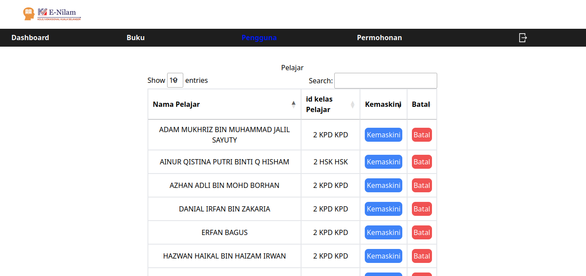

# E-nilam
E-Nilam adalah sistem perpustakaan yang memudahkan pihak admin perpustakaan Kolej Vokasional Kuala Selangor. E-Nilam yang merangkumi proses peminjaman buku, pengiraan statistik pelajar, pembacaan buku.

## ERD

## Demo sistem
### Pengguna
Register

Login Pengguna

Dashboard

Buku

History

Info pengguna dashboard

Rank

Rekod

### Admin
Admin Dashboard

Buku dashboard

Pengguna List

Permohonan List

